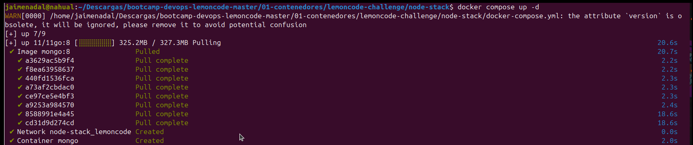
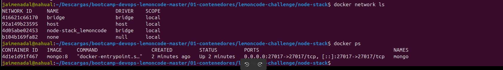
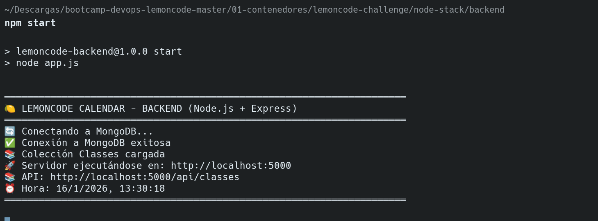
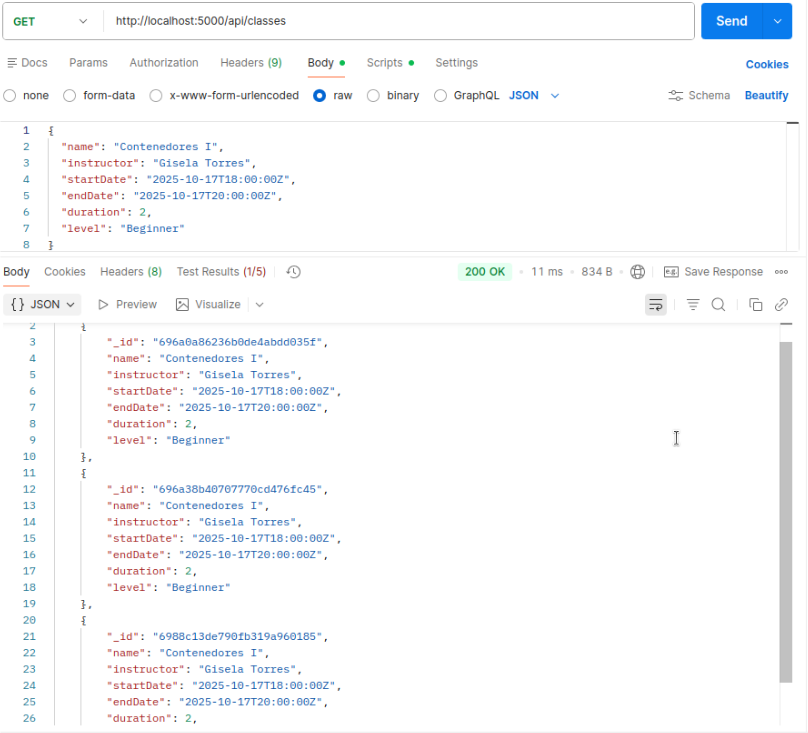
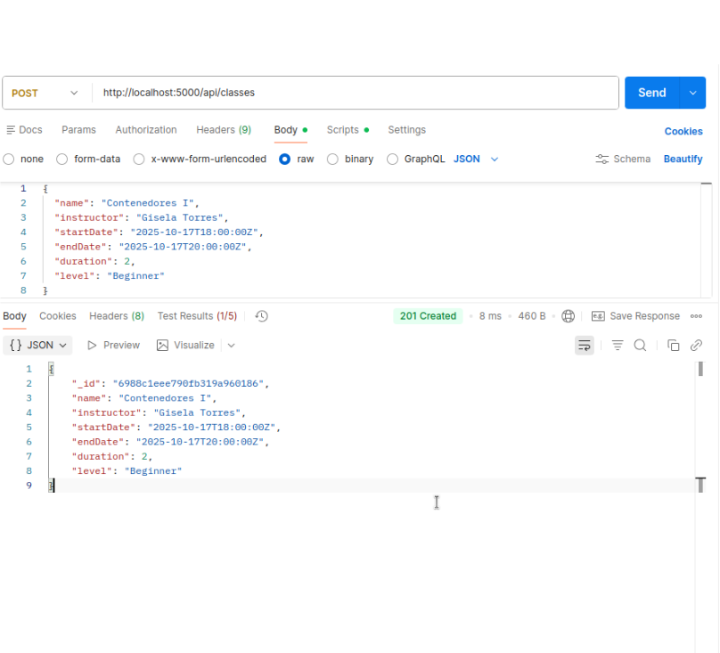
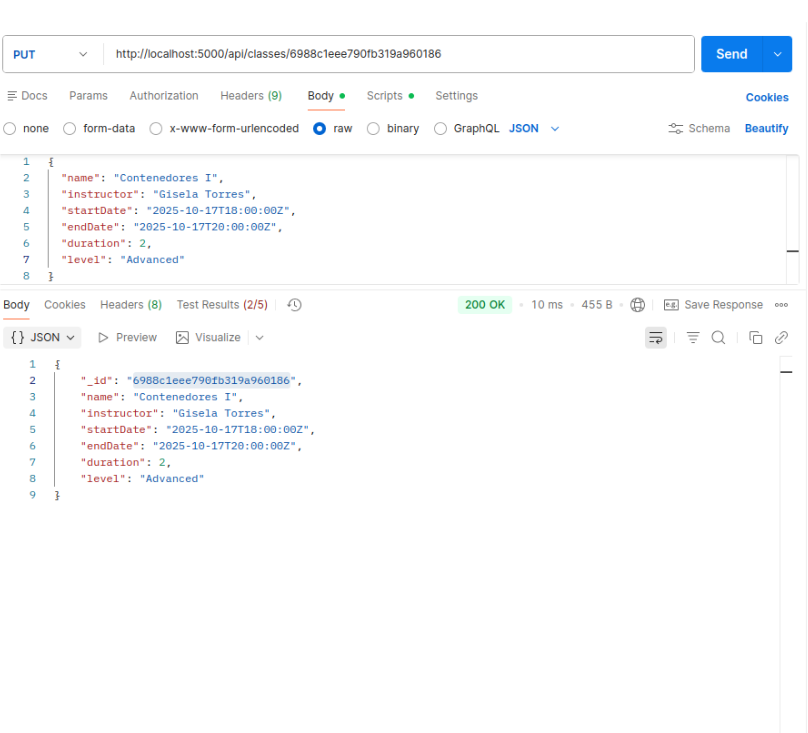
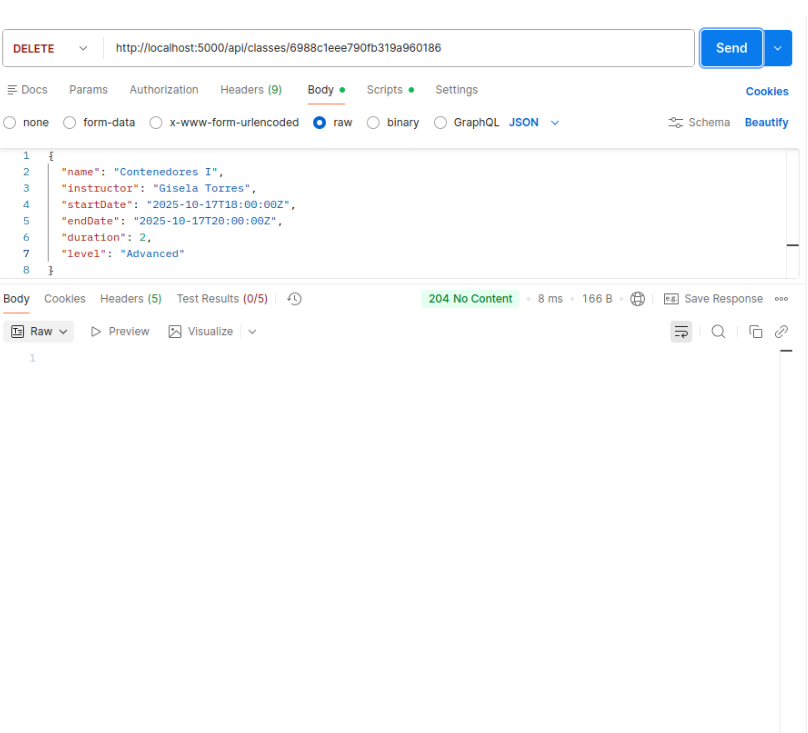
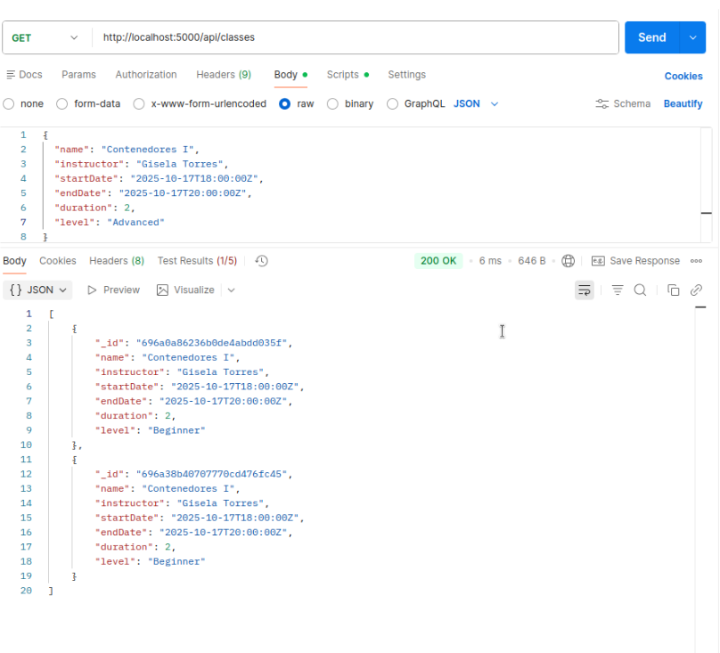

# lemoncode_module2
DevOps Bootcamp - Módulo 2: Orquestación de Contenedores (Retos 1-4)

# 🏗️ Reto 1: MongoDB en Contenedor

El objetivo de este primer reto fue desplegar una base de datos **MongoDB** utilizando docker, asegurando la persistencia de los datos y permitiendo que un backend de Node.js ejecutándose en local pudiera realizar operaciones CRUD completas

## 🛠️ Configuración del Entorno

Para el despliegue se utilizó un archivo `docker-compose.yml` con las siguientes características técnicas:

* **Versión de MongoDB**: Se utilizó la imagen oficial `mongo:8` (estable)
* **Red Docker**: Se creó una red de tipo bridge llamada `lemoncode` para aislar el tráfico
* **Persistencia**: Se configuró un volumen llamado `mongo_data` mapeado a `/data/db` para garantizar que la información no se pierda al reiniciar el contenedor
* **Mapeo de Puertos**: Se expuso el puerto `27017` del contenedor al host local

### Archivo de Configuración (`docker-compose.yml`)
```yaml
version: "3.9"

services:
  mongo:
    image: mongo:8
    container_name: mongo
    restart: unless-stopped
    ports:
      - "27017:27017"
    volumes:
      - mongo_data:/data/db
    networks:
      - lemoncode

volumes:
  mongo_data:

networks:
  lemoncode:
    driver: bridge
``` 

---

## 🚀 Despliegue y Verificación

### 1. Levantando el servicio
Se ejecutó el comando para iniciar el contenedor en segundo plano:
```bash
docker compose up -d
```


### 2. Estado del contenedor y red
Se verificó que el contenedor estuviera corriendo y que la red se hubiera creado correctamente mediante `docker ps` y `docker network ls`
* **Contenedor**: mongo
* **Estado**: Up
*  **Puerto**: 27017



---

## ✅ Conexión del Backend y Pruebas CRUD

Se arrancó el backend en local (`npm start`) configurado para apuntar al MongoDB del contenedor

### Logs de conexión exitosa
El backend confirmó la conexión y la carga de la colección de clases de forma satisfactoria



### Validación de operaciones (REST Client)
Se realizaron pruebas CRUD exitosas (GET, POST, PUT, DELETE) utilizando el cliente REST para interactuar con la API en `http://localhost:5000/api/classes`







---
